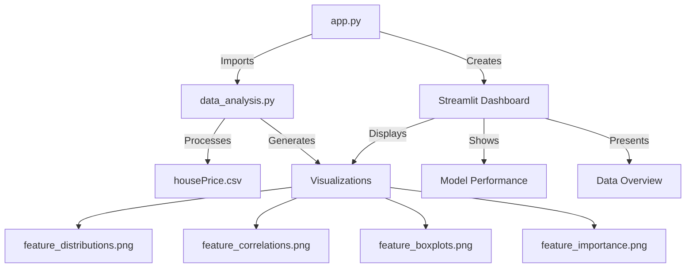
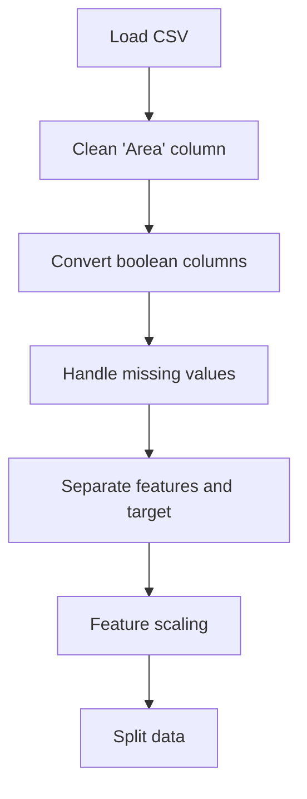
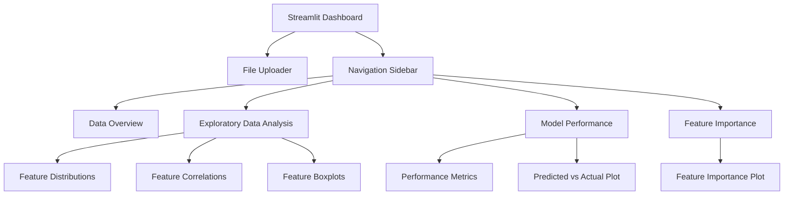

# House Price Analysis Project Documentation

## Table of Contents
1. [Project Overview](#project-overview)
2. [Project Structure](#project-structure)
3. [Data Preprocessing](#data-preprocessing)
4. [Exploratory Data Analysis](#exploratory-data-analysis)
5. [Model Building and Evaluation](#model-building-and-evaluation)
6. [Hyperparameter Tuning](#hyperparameter-tuning)
7. [Model Interpretation](#model-interpretation)
8. [User Interface](#user-interface)
9. [Potential Improvements](#potential-improvements)

## Project Overview

This project is a comprehensive House Price Analysis tool that combines data preprocessing, exploratory data analysis, machine learning modeling, and interactive visualization. The main goal is to analyze house prices based on various features and provide insights through an interactive dashboard.

## Project Structure

The project consists of two main Python files:
1. `app.py`: Contains the Streamlit dashboard code for the user interface.
2. `data_analysis.py`: Handles data preprocessing, exploratory data analysis, model building, and evaluation.

## Data Preprocessing

The `load_and_preprocess_data` function in `data_analysis.py` performs the following steps:

1. Loads the dataset from a CSV file
2. Cleans and converts the 'Area' column
3. Converts boolean columns to numeric values
4. Handles missing values using mean imputation for numeric columns
5. Separates features and target variable
6. Performs feature scaling using StandardScaler
7. Splits the data into training and testing sets

## Exploratory Data Analysis

The `perform_eda` function in `data_analysis.py` conducts exploratory data analysis:

1. Visualizes the distribution of features
2. Analyzes feature correlations
3. Identifies and visualizes outliers

These visualizations are saved as PNG files and later displayed in the Streamlit dashboard.

## Model Building and Evaluation

The `build_and_evaluate_model` function in `data_analysis.py`:

1. Initializes and trains a Random Forest Regressor
2. Makes predictions on the test set
3. Evaluates the model using Mean Squared Error, Mean Absolute Error, and R-squared metrics
4. Performs cross-validation to assess model stability

## Hyperparameter Tuning

The `tune_hyperparameters` function in `data_analysis.py`:

1. Defines a parameter grid for the Random Forest Regressor
2. Uses GridSearchCV to find the best hyperparameters
3. Returns the best estimator

## Model Interpretation

The `interpret_model` function in `data_analysis.py`:

1. Calculates feature importance from the trained model
2. Creates and saves a bar plot of feature importance

## User Interface

The Streamlit dashboard in `app.py` provides an interactive user interface with the following features:

1. File uploader for CSV input
2. Navigation sidebar with different pages:
   - Data Overview
   - Exploratory Data Analysis
   - Model Performance
   - Feature Importance
3. Interactive visualizations using Plotly
4. Display of model performance metrics

## Potential Improvements

1. Feature Engineering: Create new meaningful features that could improve model performance.
2. Alternative Algorithms: Experiment with other machine learning algorithms such as Gradient Boosting or Neural Networks.
3. Data Collection: Gather more data to potentially improve model accuracy and generalization.
4. Outlier Handling: Investigate the impact of outliers and consider robust scaling techniques.
5. Time Series Analysis: If the data includes timestamps, incorporate time series analysis for trend and seasonality detection.
6. Geospatial Analysis: If location data is available, integrate geospatial analysis to capture neighborhood effects.
7. Ensemble Methods: Combine multiple models to create a more robust prediction system.
8. Automated Feature Selection: Implement automated feature selection techniques to identify the most important predictors.
9. Model Explainability: Integrate more advanced model interpretation techniques like SHAP (SHapley Additive exPlanations) values.
10. Continuous Integration/Continuous Deployment (CI/CD): Set up a CI/CD pipeline for automated testing and deployment of the application.
11. User Authentication: Add user authentication to protect sensitive data and allow for personalized experiences.
12. Caching: Implement caching mechanisms to improve the dashboard's performance, especially for computationally intensive operations.
13. Error Handling: Enhance error handling and provide more informative error messages to users.
14. Data Versioning: Implement a data versioning system to track changes in the dataset over time.
15. A/B Testing: Set up A/B testing for different model configurations or UI layouts to optimize user experience and model performance.